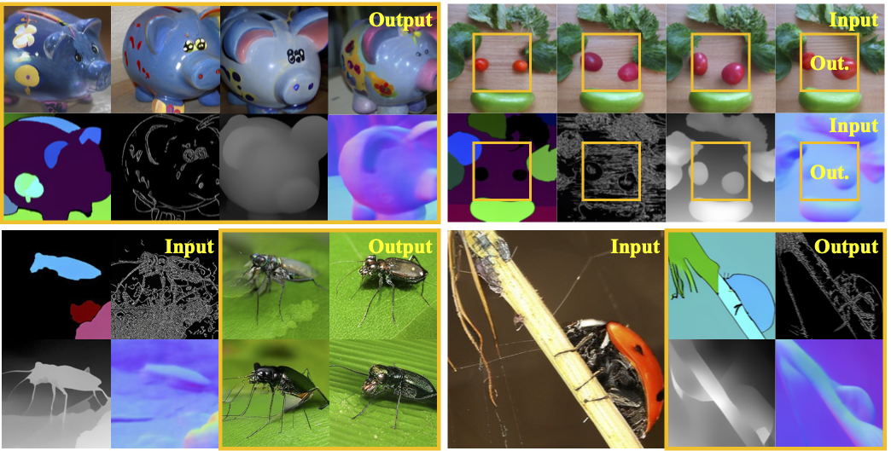

> [**ControlVAR: Exploring Controllable Visual Autoregressive Modeling**](https://arxiv.org/pdf/2406.09750)
>
> Xiang Li, Kai Qiu, Hao Chen, Jason Kuen, Zhe Lin, Rita Singh, Bhiksha Raj

<p align="center"></p>

# Updates
- **(2024-07-26)** We released the code for Intel HPU training. 
- **(2024-07-25)** Repo created. The code and datasets will be released in two weeks.


# Setup

Get pre-trained VQVAE from VAR
```
mkdir pretrained
cd pretrained
wget https://huggingface.co/FoundationVision/var/resolve/main/vae_ch160v4096z32.pth
```

# Dataset

The pseudo-labeled ImageNet dataset (mask, canny, depth, and normal) is available at [hugging-face](ang9867/ImageNet-C). Please download the original ImageNet2012 dataset from [official website](https://www.image-net.org/) and arrange the files in the following format.

```
ImageNet2012
├── train
├── val
├── train_canny
├── train_mask
├── train_normal
├── train_depth
├── val_canny
├── val_mask
├── val_normal
└── val_depth
```

# Train

```sh
python3 train_control_var_hpu.py --batch_size $bs --dataset_name imagenetC --data_dir $path_to_ImageNetC --gpus $gpus  --output_dir $output_dir --multi_cond True --config configs/train_mask_var_ImageNetC_d12.yaml --var_pretrained_path pretrained/var_d12.pth
```

# Inference
```angular2html
python3 train_control_var_hpu.py --batch_size $bs --dataset_name imagenetC --data_dir $path_to_ImageNetC --gpus $gpus --output_dir $output_dir --multi_cond True --val_only True --resume $ckpt_path
```

## Citation
```
@article{li2024controlvar,
  title={ControlVAR: Exploring Controllable Visual Autoregressive Modeling},
  author={Li, Xiang and Qiu, Kai and Chen, Hao and Kuen, Jason and Lin, Zhe and Singh, Rita and Raj, Bhiksha},
  journal={arXiv preprint arXiv:2406.09750},
  year={2024}
}
```
